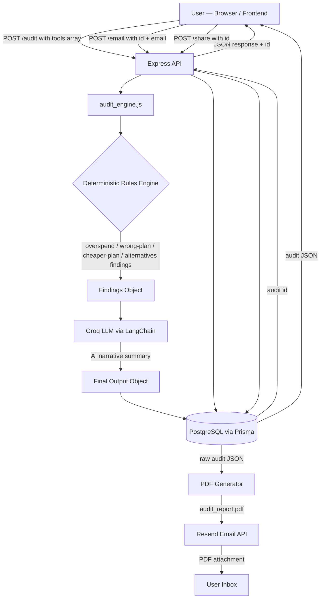

# Architecture

## System Diagram

---

## Data Flow: Input → Audit Result

1. **User submits their stack** via the frontend form — each tool entry includes `name`, `plan`, `seats`, `monthlySpend`, and `useCase`.

2. **`/audit` POST handler** receives `{ data: tools[] }` and calls `audit_engine(data)`.

3. **Audit engine (deterministic pass)** iterates every tool through four sequential checks:
   - **Step 0 — Overspend:** Compares actual monthly spend against `seats × plan price`. Flags discrepancies.
   - **Step 1 — Wrong plan:** If a team plan is used with fewer than 3 seats, checks whether a solo plan from the same vendor is cheaper.
   - **Step 2 — Cheaper plan (same vendor):** Finds lower-cost plans from the same tool that would match the team size.
   - **Step 3 — Alternative tools:** Scans all other tools in the `TOOLS` data object that share the same `useCase` and are cheaper.

4. **Savings aggregation:** For each tool, the finding with the highest `monthlySaving` (excluding overspend) is selected. These are summed to produce `monthlySave` and `yearlySave`.

5. **LLM summary pass:** The structured findings object is sent to Groq (llama-3) via LangChain to generate a human-readable markdown narrative. If this call fails, a deterministic fallback summary is constructed from the findings directly.

6. **Persistence:** The full output is stored in PostgreSQL via Prisma. The generated `id` is returned to the client so the result can be shared or emailed later.

7. **Email/PDF flow:** On `/email`, the stored audit is fetched, a PDF is generated server-side, sent as an attachment via Resend, and immediately deleted from disk.

---

## Stack Choices

| Layer         | Choice                       | Reason                                                                  |
| ------------- | ---------------------------- | ----------------------------------------------------------------------- |
| Runtime       | Node.js + Express            | Fast to scaffold, familiar, good ecosystem for this scope               |
| ORM           | Prisma + PostgreSQL          | Type-safe queries, easy schema migrations, free-tier hosting on Railway |
| LLM           | Groq (llama-3) via LangChain | Free tier, fast inference, provider-agnostic abstraction                |
| Email         | Resend                       | Simplest attachment API in Node.js, no SMTP config                      |
| PDF           | Custom generator (pdfkit)    | Full control over layout matching the brand                             |
| Frontend      | React + Vite + Tailwind      | Fast iteration, no opinion on state management at this scale            |
| Rate limiting | `express-rate-limit`         | Zero-config, in-process, good enough for single-instance deploy         |

---

## Scaling to 10,000 Audits/Day

The current architecture is single-process and synchronous in critical paths. Here is what would need to change:

**LLM calls become the bottleneck first.** At 10k audits/day (~7/min average, but bursty), synchronous Groq calls would either exhaust rate limits or create long response times. The fix: move the LLM summary step into a background job queue (BullMQ + Redis). The `/audit` endpoint returns findings immediately; the summary is written back to the DB and pushed to the client via WebSocket or polling.

**PDF generation is CPU-blocking.** Move `generatePDF` into a worker process or a dedicated microservice. Alternatively, use a hosted PDF API (e.g., PDFShift) to offload rendering.

**Horizontal scaling.** The Express app is stateless (no in-memory session state), so adding more instances behind a load balancer (Railway, Fly.io, or ECS) is straightforward. The rate limiter would need to move to Redis (`rate-limit-redis`) so all instances share the same counter.

**TOOLS data object.** Currently hardcoded in `data.js`. At scale this becomes a database table with a CMS or admin UI for updates, since pricing changes frequently.
